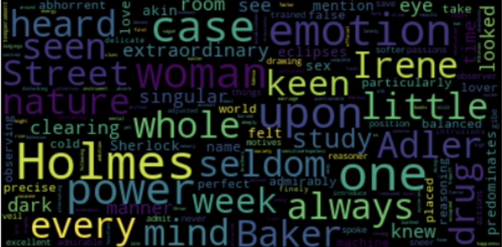

# nlp-wordcloud-txt

# Repo Overview

The goal of this repo is to analyze a text file and generate a wordcloud 
that highlights the most commonly used words in the text. The text 
file contains a collection of data where each line represents a piece of 
information. By processing the text data, we can identify the frequently 
occurring words and visualize them in a wordcloud

# Results

